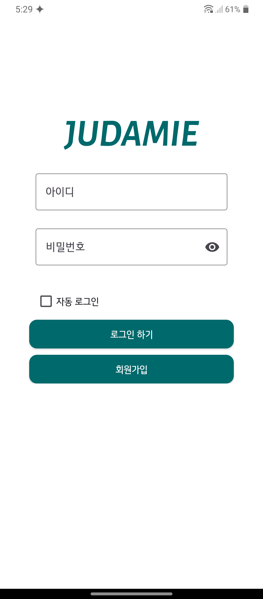

# 주류 픽업 서비스 주다미(JUDAMIE)

> 개발 기간 : 2025.01.06 ~ 2025.02.05
> 

## 🌟 배포 주소
>
> 요구사항 명세서 : 
> [Google Docs 1조 요구사항명세서.xlsx](https://docs.google.com/spreadsheets/d/1-ofXDRmkZk47_xXCGW6bR6qeVCGTsSX3/edit?gid=1388090367#gid=1388090367)
>
> 피그마 : 
> [5팀 쇼핑몰 프로젝트_Judamie](https://www.figma.com/design/KfQfESZVDaSN9AjsIrL7xR/5%ED%8C%80-%EC%87%BC%ED%95%91%EB%AA%B0-%ED%94%84%EB%A1%9C%EC%A0%9D%ED%8A%B8_Judamie?node-id=0-1&p=f&t=C6MiEut56U40nvz5-0)
>
> DB설계 :
> [주다미DB](https://docs.google.com/spreadsheets/d/1SCuNlvhLw9gVG4kw_PFAJ-dmJBbQWXTtrIrgylUT9h0/edit?gid=378717404#gid=378717404)
> 

## 👨‍👩‍👧‍👦 팀 소개

| 채수범 | 황서영 | 김성한 | 김혜민 |
| --- | --- | --- | --- |
|  |  |  |  |
|  |  |  |  |

## 🔍 프로젝트 소개

> **"원하는 주류를 원하는 장소에서 간편하게 픽업하세요"**
>
>
> 주다미는 원하는 주류를 구매하여 원하는 장소에서 픽업할 수 있는 온라인 주류 쇼핑몰입니다
>
> 법적인 테두리안에서 주류를 온라인으로 판매할 수 있는 방법을 모색하여 기획했습니다
>
> 카테고리별로 주류를 검색할 수 있고 지도에서 구매한 주류를 픽업할 장소를 고를수있습니다
> 

## 🐈기술 스택

### **Environment**

### Config

### Development

### Communication

## 📺 화면 구성

| 로그인 화면 | 홈 화면 | 픽업지 선택화면 | 픽업지 정보보기 |
| --- | --- | --- | --- |
|  |  | |  |

| 검색하기 | 상품보기 | 장바구니 | 결제하기 |
| --- | --- | --- | --- |
|  |  |  |  |

| 리뷰작성 | 리뷰보기 |
| --- | --- |
|  |  |
## 🔔 주요 기능

❗카테고리별 주류 진열 & 검색

- 판매자는 카테고리별로 주류진열가능
- 고객은 카테고리별로 주류를 구경할 수 있고 검색할 수 있음

❗픽업지 선택

- 고객은 구매한 주류를 픽업할 픽업지를 지도에서 선택할 수 있음

❗쿠폰 기능

- 관리자는 고객에게 기간이 정해진 쿠폰을 지급하며 고객은 정해진 기간내에 쿠폰을 사용하여 물건을 구매할 수 있음

❗리뷰기능

- 고객이 구매한 주류를 픽업하고 픽업완료 버튼을 누르면 품목별로 리뷰를 작성할 수 있음

## 🏗️ **아키텍처**

❗흐름

